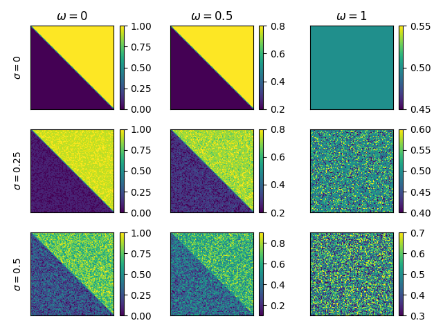
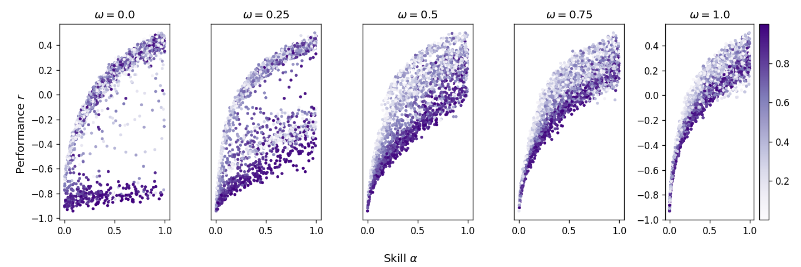
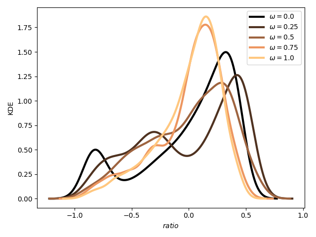
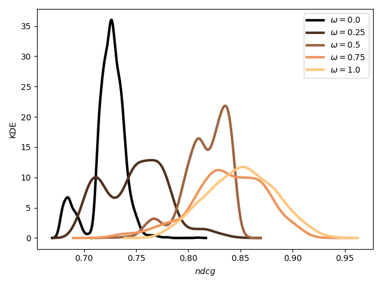
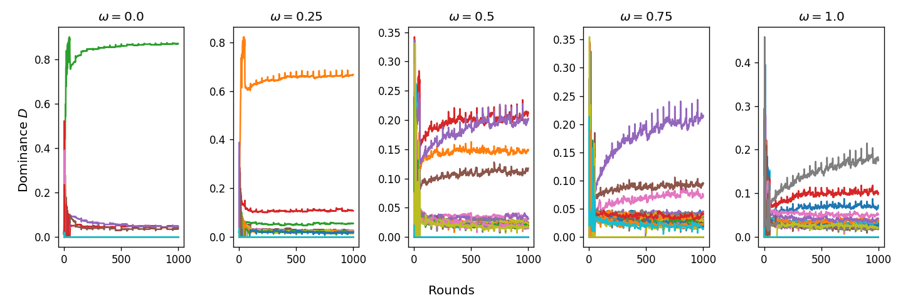
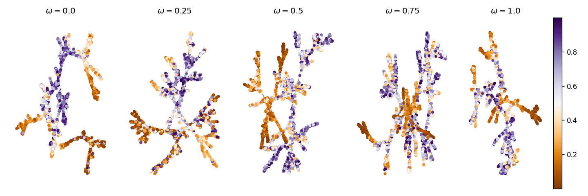
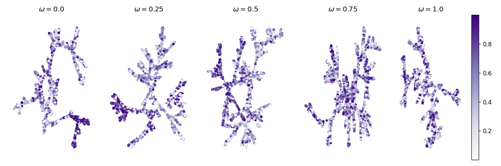

# Understanding How Agents Learn in Multi-Strategy Games

## Introduction

In many real-world settings—whether online gaming communities, financial markets, or even social media dynamics—individuals (or “agents”) continually choose among multiple strategies without complete information about payoffs. Instead of a single “best move,” they face an evolving landscape of opponents, personal skill, and social influence. My goal in this work is to tease apart how hidden matchup structure (i.e., which strategy tends to beat which) and peer connections jointly shape an agent’s performance, the popularity of certain strategies, and whether cohesive subgroups (or “strata” of players) emerge.

More concretely, imagine a large pool of players, each capable of playing any one of a dozen or more strategies. They rarely know in advance which strategy is truly dominant—if such a thing even exists. Instead, they learn from experience:

> “When I played Rock against Paper, I lost 70 percent of the time.”  
> “When I chose Strategy 7 against Strategy 3, I won roughly half the time.”  

Meanwhile, they also look around:

> “Everyone in my network seems to be gravitating toward Strategy 2.”  
> “Players who consistently win have been clustering around Strategies 5 and 9.”  

Over time, these factors feed back into each other. Popular strategies become easier to find opponents for, which can accelerate learning or reinforce fads. Skilled players may gravitate toward “hidden gems”—weakly exploited matchups—and thereby collect outsized wins. Less skilled players may herd into whatever seems safest, even if it’s not optimal.

This interplay—between learning (via data from past matches) and social influence (via a dynamic “trust” network)—is the core of my working paper. In this blog post, I’ll walk through:

1.  The high-level motivation and problem statement.  
2.  The modeling framework: how I represent hidden matchup probabilities, agent energy (conformity vs. personal information), and network sparsity.  
3.  The simulation design: the mechanics of pairing, updating, and re-filtering the social graph.  
4.  Key empirical findings: how “balance” (i.e., how fair matchups are) and “peer emphasis” drive stratification, dominance, and diversity.  
5.  Preliminary conclusions, limitations, and directions for future work.

I’ve organized this so that you can jump to whichever section interests you most, but I recommend reading straight through if you want the full narrative. Let’s begin by clarifying exactly what problem we’re solving and why it matters.

---

## 1. Context and Problem Statement

### 1.1 Why Multi-Strategy Learning Matters

When players (or decision-makers) repeatedly choose among multiple options, they rarely face a single “rock-paper-scissors” cycle that stays fixed. Instead, matchups evolve—some strategies get patched or nerfed; new tactics are discovered; social contagion causes a once-niche move to become “meta.” In online competitive games (e.g., MOBAs or card games), we see ephemeral but intense oscillations in which characters or decks are “good.” In financial markets, different portfolio strategies (momentum, mean-reversion, volatility arbitrage) wax and wane in popularity, and traders infer each other’s success from public signals (like fund performance).

Yet in most of these settings:

- **Players lack full payoff knowledge.** They must learn which options work best gradually through repeated matchups.  
- **Social influence and visibility matter.** Information about successful agents often diffuses through social graphs (friends, followers, reputation rankings). Agents sometimes imitate top performers rather than independently exploring.  
- **Hidden structure can create stratification.** If one strategy is only slightly better against another, but that pairing’s outcomes amplify over time, a small group of skilled agents might consolidate around that advantage, leaving the rest behind.

Despite abundant anecdotal evidence—from esports enthusiasts to hedge fund managers—there has been little systematic study of how (a) hidden matchup probabilities, (b) personal skill, and (c) network influence jointly shape long-run outcomes in large populations. That gap is what this work aims to address.

### 1.2 The Core Question

Put simply:

> **How do agents learn about and adapt to a complex network of matchups when both individual experience and peer influence feed into decision-making, and what macroscopic patterns (dominance, stratification, diversity) emerge?**

Breaking that down further:

1.  **Hidden matchup structure (the “c”-matrix).** Each strategy \( s \) has an unknown probability of beating every other strategy \( s' \). We’ll call that \( c_{s s'} \). If \( c_{s s'} \) is close to 1, strategy \( s \) almost always wins against \( s' \); if it’s close to 0.5, the matchup is balanced. Agents don’t know these \( c_{s s'} \) values initially; they estimate them over time based on wins and losses.  
2.  **Intrinsic skill (\( \alpha \)).** Even if matchups were perfectly balanced, some agents are better players than others. We capture this as a skill parameter \( \alpha_i \in [0,1] \). Higher \( \alpha_i \) means more likely to convert a favorable matchup into a win, and even in neutral matchups they tend to have an edge.  
3.  **Social influence (the “J”-matrix).** Agents observe or remember who wins and loses. They form dynamic “trust” or “influence” links based on how similar their performance ratios are. If two agents have very similar win–loss records, they’re more likely to stay connected; if one is consistently winning while the other is not, that link usually dissolves.  
4.  **Decision tension: Conformity vs. personal learning.** Each agent balances two impulses when choosing a strategy in any given round:  
    - **Peer conformity.** “I want to pick the same strategy that my trusted neighbors in the network are picking.”  
    - **Personal learning.** “I want to pick the strategy that my own data suggests has the highest win probability.”  

Given all of the above, we simulate thousands of agents over many rounds. We ask:

- When matchups are heavily imbalanced (i.e., one strategy beats most others convincingly), do a few skilled agents find that “best strategy” and lock out everyone else?  
- When matchups are nearly balanced (all \( c_{s s'} \approx 0.5 \)), does skill dominate and keep diversity high?  
- How does the weight an agent places on peers vs. personal data (\( \beta \) parameter) influence her long-run performance and whether she gets “locked in” to a suboptimal choice?  
- What does the emergent social network look like under different conditions: Is it a single “winner’s clique” with everyone else on the periphery, or is it a more homogeneous, well-mixed graph?

In short: this work is about the interplay of **hidden structure**, **learning**, and **social influence**. In the sections that follow, I’ll outline the modeling framework in more detail and then walk through the simulation results.

---

## 2. Modeling Framework

We begin by describing three interlocking components:

1.  The **matchup model**—how we generate and parameterize the unknown win-loss probabilities \( c_{s s'} \).  
2.  The **agent decision model**—how each agent’s “energy” function balances conformity (network alignment) and personal learning (own estimates of matchups).  
3.  The **social network sparsification**—how we go from a fully connected graph of pairwise influence to a realistic, sparse “triangular maximally filtered graph” (TMFG).

Throughout, I’ll reference figures from the paper to clarify each piece. When you see “\<!-- Insert Figure X here -->”, please replace that with the corresponding image.

### 2.1 Matchup Model: Parameterizing Hidden Win Probabilities

Suppose there are \( S \) possible strategies (in our experiments, \( S = 50 \)). For any ordered pair \((s, s')\), define \( c_{s s'} \) as the probability that \( s \) beats \( s' \) in a head-to-head. Of course, \( c_{s' s} = 1 - c_{s s'} \) (we assume no draws). We need a way to generate a family of such matrices in a way that is:

1.  **Tunable in “balance.”** We want to move smoothly from a fully imbalanced regime (some strategies dominate most others) to a fully balanced regime (all matchups are essentially 50–50).  
2.  **Ability to inject randomness (“noise”).** Even in balanced regimes, we want some variability so that no two pairs are exactly 0.5.

To do this, introduce two parameters:

- **Balance** \( \omega \in [0,1] \). When \( \omega = 0 \), the matchup structure is heavily imbalanced (some strategies almost always win against others). When \( \omega = 1 \), matchups are nearly fair (all \( c_{s s'} \approx 0.5 \)).  
- **Bandwidth** \( b \in [0,1] \). This modulates how “noisy” or “spread out” the \( c_{s s'} \) values are. At \( b = 0 \), the sampled matchups can be extremely lopsided; at \( b = 1 \), they cluster tightly around 0.5.

Concretely, for each unordered pair \(\{s, s'\}\), sample a latent variable \( u \) uniformly from \([0,1]\). Then set

\[
c_{s s'} 
\;=\; 
\bigl(1 - \tfrac{\omega}{2}\bigr)\,\bigl(1 - b\,\sin(\tfrac{\pi\,u}{2})\bigr) \;+\; \tfrac{\omega}{2},
\]
with \( c_{s' s} = 1 - c_{s s'} \). You can think of \( (1 - \tfrac{\omega}{2}) \) as the “maximum skew” possible when \( \omega = 0\), and adding \( \tfrac{\omega}{2} \) drags everything back toward 0.5. The precise functional form can vary, but this construction ensures:

- When \( \omega = 0 \), \( c_{s s'} \) ranges from near 0 to near 1 (given extreme draws of \( u \) and \( b \) small).  
- When \( \omega = 1 \), \( c_{s s'} \) is always around 0.5 with small random deviations controlled by \( b \).

In practice, in all our experiments we hold bandwidth \( b = 0.5 \), and vary \( \omega \) from 0 to 1 to interpolate between “rock-paper-scissors meets super-teams” and “all matchups are basically coin-flips.”

> **Figure 1.** Three example \(50 \times 50\) matrices of \( c_{s s'} \).  
> - Left panel (\(\omega = 0\)): many entries near 0 or 1.  
> - Middle panel (\(\omega = 0.5\)): intermediate spread.  
> - Right panel (\(\omega = 1\)): almost uniform around 0.5.

### 2.2 Agent Decision Model: Energy, Conformity, and Personal Learning

Each agent \( i \) is endowed with:

- An **intrinsic skill** \( \alpha_i \in [0,1] \), drawn once at the beginning. Higher \( \alpha_i \) means more adept at converting any given matchup probability into an actual win.  
- A local estimate \( \widehat{c}^{(i)} \) of the population’s hidden matchup matrix \( c \). Initially, \( \widehat{c}^{(i)} \) is uniform (every pairing looks 50–50). Over time, agent \( i \) updates \( \widehat{c}^{(i)}_{s s'} \) by counting wins and losses each time she sees \( (s, s') \) in her own matches.  
- A **peer weight** parameter \( \beta_i \in [0,1] \), which controls how much she cares about copying neighbors versus following her own data. We'll often hold \( \beta_i \) constant across agents in a single experiment, but we also explore distributions of \( \beta_i \) to see heterogeneous behaviors.

#### 2.2.1 Win Probability Given Skill and Matchup

If agent \( i \) (skill \( \alpha_i \)) chooses strategy \( s \) against agent \( j \) (skill \( \alpha_j \)) choosing strategy \( s' \), then the chance that \( i \) actually wins is

\[
P\bigl(\text{win for }i \mid s, s'\bigr)
\;=\;
\frac{\alpha_i \cdot c_{s s'}}{\alpha_i \cdot c_{s s'} \;+\; \alpha_j \cdot c_{s' s}}.
\]

In other words, if \( c_{s s'} \) is large (i.e., \( s \) is strong vs. \( s' \)) and \( \alpha_i \) is large, \( i \) has a high probability to win. If both \( \alpha \)-values are equal and \( c_{s s'} = 0.5 \), then it’s a fair coin toss.

#### 2.2.2 Learning: Updating Local Estimates \( \widehat{c}^{(i)} \)

Each agent \( i \) maintains two counters for every ordered pair \((s,s')\):

- \(\text{wins}^{(i)}_{s s'}\): how many times \( i \) chose \( s \), the opponent chose \( s' \), and \( i \) won.  
- \(\text{losses}^{(i)}_{s s'}\): how many times \( i \) chose \( s \), the opponent chose \( s' \), and \( i \) lost.

Every time \( i \) plays \( (s,s') \), she increments one of these counters based on the outcome. Then her local estimate is

\[
\widehat{c}^{(i)}_{s s'}
\;=\;
\frac{\text{wins}^{(i)}_{s s'}}{\text{wins}^{(i)}_{s s'} + \text{losses}^{(i)}_{s s'}}.
\]

As a result, after repeated exposure to the same matchup \( (s,s') \), \( \widehat{c}^{(i)}_{s s'} \) converges (in expectation) to the true \( c_{s s'} \). But if \( i \) rarely sees \( (s,s') \), her estimate remains noisy.

#### 2.2.3 Peer Conformity: Building the Influence Matrix \( J \)

Rather than assume a fixed social network, we infer peer influence based on performance similarity. Define each agent \( i \)’s **performance ratio**:

\[
r_i 
\;=\; 
\frac{\text{(total wins)}_i \;-\; \text{(total losses)}_i}{\text{(total wins)}_i + \text{(total losses)}_i}.
\]

Thus \( r_i \in [-1,1] \). If \( r_i \) is close to 1, \( i \) has been winning almost all her matches; if \( r_i \) is near –1, she has been losing nearly everything. Agents tend to form links to similarly successful (or unsuccessful) peers. Concretely, for every distinct pair \( (i,j) \):

1.  If \( r_i = r_j \) exactly, set \( J_{ij} = 1 \) (full trust).  
2.  If \( |r_i - r_j| = 2 \) (i.e., one agent has \( r = 1 \) and the other \( r = -1 \)), set \( J_{ij} = 0 \) (no connection).  
3.  Otherwise, flip a biased coin: define  
    \[
    p_{ij} \;=\; 
    \frac{2}{2 - |\,r_i - r_j\,|}, 
    \quad(\text{note } p_{ij} \in (0,1)),
    \]
    and draw \( U \sim \text{Uniform}[0,1] \). If \( U \le p_{ij} \), then \( J_{ij} = 1 \); else \( J_{ij} = 0 \).

Thus, the closer \( r_i \) and \( r_j \) are, the higher the probability they remain connected. If performance diverges, the link breaks. Over time, winners form clusters, mid-tier players cluster together, etc.

#### 2.2.4 Energy Function: Conformity vs. Self-Information

At each decision point, agent \( i \) evaluates an “energy” for choosing a particular strategy \( s \) in round \( t \). The energy has two terms:

1.  **Peer component:** How aligned would \( i \) be with her neighbors if she chose \( s \) while they choose their own strategies? We approximate this by counting how many neighbors \( j \) have chosen the same strategy \( s_j = s \) and weighing by \( J_{ij} \).  
2.  **Personal learning component:** If \( i \) chooses \( s \), her expected winning probability (averaged over an ensemble of opponents’ strategies according to her local estimate \( \widehat{c}^{(i)} \)) is approximately  
    \[
    \max_{s'} \widehat{c}^{(i)}_{s s'}.
    \]
    Thus, picking a strategy with higher local estimated win probability lowers energy.

Formally, for each candidate strategy \( s \), agent \( i \) computes

\[
E_i(s) 
\;=\; 
-\,\beta
\underbrace{\sum_{j\,:\,s_j = s} J_{ij}}_{\text{peer alignment}}
\;-\; 
(1 - \beta)\,\underbrace{\max_{s'} \widehat{c}^{(i)}_{s s'}}_{\text{self-info}}.
\]

Lower energy is better. If \( \beta = 1\), the agent is purely conformist (always picks what most of her trusting neighbors pick). If \( \beta = 0\), she is purely self-driven (ignores peers, chooses the locally estimated “best” matchup).

#### 2.2.5 Decision Rules

We examine two ways an agent can minimize her energy:

1.  **Greedy (Deterministic) Update:** Agent \( i \) simply picks  
    \[
    s^\ast = \arg\min_{s \in \{1,\dots,S\}} E_i(s).
    \]  
    If there are ties, break them uniformly at random.  
2.  **Stochastic (Boltzmann) Update:** Agent \( i \) samples a strategy \( s \) with probability  
    \[
    P\bigl(\text{choose } s\bigr)
    \;=\;
    \frac{\exp\bigl(-\,E_i(s)/T\bigr)}{\sum_{s'} \exp\bigl(-\,E_i(s')/T\bigr)},
    \]
    where \( T \) is a small “temperature” parameter (e.g., \( T = 0.01\)). Here, even if one strategy has slightly lower energy, there’s some small chance of picking something else, which encourages exploration. As \( T \to 0 \), this converges to the greedy rule.

The Boltzmann version models the idea that real agents sometimes explore suboptimal choices—perhaps to avoid getting trapped in a local “peer consensus” that’s actually bad.

### 2.3 Network Sparsification: Triangular Maximally Filtered Graph (TMFG)

In principle, each agent \( i \) could look at all \( N-1 \) other agents, check who among them picked the same \( s \), multiply by \( J_{ij} \), and compute the peer term in energy. But in many realistic settings (social media feeds, game lobbies, financial networks), you simply can’t process thousands of potential influences each time you decide. People focus on a handful of trusted peers.

To model this, after computing the full \( N \times N \) adjacency matrix \( J \), we apply a **Triangular Maximally Filtered Graph** (TMFG) filter. TMFG preserves exactly \( 3N - 6 \) edges—enough to make a planar, triangulated complex—but drops weaker links. The algorithm proceeds roughly as follows:

1.  **Start** with the four nodes that have the strongest complete subgraph (i.e., the tetrahedron maximizing the sum of weights among those four).  
2.  **Iteratively add** the next node that, when connected to three existing nodes, yields the maximal incremental sum of weights.  
3.  **Continue** until all nodes are in a planar, triangulated graph.

The result is a sparse adjacency matrix \( J^{\mathrm{TMFG}} \) with exactly \( 3N - 6 \) edges. In our runs, \( N = 2500 \), so \( 3N - 6 = 7494 \) edges remain. This gives each agent a modest neighbor list (on average about three neighbors per agent, though actual degree distribution is skewed), and ensures that peer influence is focused on a few strong connections rather than en masse.

In summary, each round we:

1.  Observe all current \( r_i \) and form the full (dense) \( J \)-matrix.  
2.  Filter \( J \) via TMFG to get \( J^{\mathrm{TMFG}} \).  
3.  Each agent computes energy using only links in \( J^{\mathrm{TMFG}} \) (peers beyond that subset are effectively invisible).  
4.  Agents pick strategies, match up randomly, and the cycle repeats.

---

## 3. Experimental Design

With the modeling framework established, let’s outline how a full simulation unfolds. Our goal is to create a large-scale, high-repetition environment where we can vary key parameters—especially the **balance** \( \omega \) and the **peer weight** \( \beta \)—and see how global patterns emerge.

### 3.1 Agent Population and Strategy Space

- **Number of agents:** \( N = 2500 \). For conceptual clarity, we imagine placing them on a 50 × 50 grid, but grid positions are only for bookkeeping; actual pairings are random each round.  
- **Strategy catalog:** \( S = 50 \). We index strategies by \( s = 1, 2, \dots, 50 \). At the start of a simulation, we generate a hidden \( 50 \times 50 \) matrix \( c \) of true win probabilities, using a chosen balance \( \omega \) (with moderate bandwidth \( b = 0.5 \)).  
- **Skill distribution:** \( \alpha_i \sim \mathrm{Uniform}[0,1] \). This is each agent’s true ability. We hold \( \alpha \) fixed throughout each run.  
- **Peer weight:** \( \beta \). In any one experiment, either (a) all agents share the same \( \beta \in \{0.0, 0.25, 0.5, 0.75, 1.0\} \), or (b) we draw \( \beta_i \) i.i.d. Uniform[0,1] to see what happens under heterogeneity. In the results we’ll focus mostly on the homogeneous-\( \beta \) case for clarity.

### 3.2 Simulation Loop

We run for \( T = 1000 \) rounds. Each round consists of four steps:

1.  **Strategy Selection.**  
    - If we use **Greedy** updates, each agent \( i \) computes \( E_i(s) \) (using her current \( \widehat{c}^{(i)} \), her neighbors’ most recent strategies, and the current \( J^{\mathrm{TMFG}} \)), and picks  
      \[
      s_i = \arg\min_{s} E_i(s).
      \]  
    - If we use **Boltzmann** updates, each agent samples \( s_i \) with probability  
      \[
      P\bigl(\text{choose } s\bigr)
      \;=\;
      \frac{\exp\bigl(-\,E_i(s)/T_{\mathrm{temp}}\bigr)}{\sum_{s'} \exp\bigl(-\,E_i(s')/T_{\mathrm{temp}}\bigr)},
      \]  
      typically with \( T_{\mathrm{temp}} = 0.01 \).  

2.  **Pairing.** Randomly permute the \( N \) agents and match them into \( N/2 = 1250 \) pairs. If \( N \) were odd, we’d leave one agent unpaired, but for \( N = 2500 \) it’s even.  

3.  **Play Matches.** For each pair \((i,j)\), their respective strategies are \((s_i, s_j)\). Agent \( i \) wins with probability  
    \[
    \frac{\alpha_i \, c_{s_i s_j}}{\alpha_i \, c_{s_i s_j} \;+\; \alpha_j \, c_{s_j s_i}},
    \]  
    and \( j \) wins with the complementary probability. We record wins/losses for both players. This simultaneously updates each agent’s global “total wins” and “total losses” (for recalculating \( r_i \)) and also updates “win counters” for local estimates \( \widehat{c}^{(i)} \).  

4.  **Network Update (Every 50 Total Matches).** We don’t recompute \( J \) after every single match (too noisy and expensive). Instead, after every 50 total match-outcomes, we:  
    1.  Recalculate each agent’s performance ratio \( r_i \).  
    2.  Build the full, dense \( J \)-matrix based on the rules in Section 2.2.3.  
    3.  Filter \( J \) through TMFG to obtain the sparse \( J^{\mathrm{TMFG}} \).  

   Since there are 1250 matches per round, this means we rebuild \( J^{\mathrm{TMFG}} \) roughly once every \( 0.04 \) rounds—effectively, once every round in the limit.  

Over the course of 1000 rounds, each agent thus plays 1000 matches, each time updating local counters for \( \widehat{c}^{(i)} \) and occasionally rebuilding her notion of peer influence.

### 3.3 Parameter Sweeps

We are most interested in how outcomes depend on:

1.  **Balance** \( \omega \in \{0.0, 0.25, 0.5, 0.75, 1.0\}. \)  
2.  **Peer weight** \( \beta \in \{0.0, 0.25, 0.5, 0.75, 1.0\}. \)  
3.  **Update rule:** “Greedy” vs. “Boltzmann.”

All other aspects (e.g., \( N = 2500 \), \( S = 50 \), bandwidth \( b = 0.5 \), skill distribution Uniform[0,1], TMFG sparsity) are held fixed. For each pairing of \( (\omega, \beta, \text{update rule}) \), we run 10 independent trials (with fresh random seeds) to average out sampling noise.

Our main **metrics** are:

- **Performance ratio distribution.** The final histogram of \( r_i \) across all agents, to see if it’s unimodal or bimodal.  
- **Skill vs. Performance scatter.** Plot \( r_i \) (on the \( y \)-axis) vs. \( \alpha_i \) (on the \( x \)-axis), colored by \( \beta \) if heterogeneous.  
- **Ranking quality.** For each agent \( i \), we compare the local estimate \( \widehat{c}^{(i)} \) (at round 1000) to the ground truth \( c \). We compute Normalized Discounted Cumulative Gain (NDCG) by asking: “If I rank all strategies \( s \) by how likely \( i \) thinks they’ll win against a random opponent, how close is that permutation to the true ranking based on \( c \)?” This measures how well agents have learned matchups.  
- **Strategy usage (“dominance”).** Track, over time, the fraction of agents choosing each strategy—does one strategy capture nearly all users (i.e., dominance ≈ 0.8), or does a handful share usage ≈ 0.1–0.2 each?  
- **Network structure.** At the end of each run, visualize (on a lower-dimensional embedding) the TMFG graph, coloring nodes by \( \alpha_i \) or \( r_i \) to see if there’s core–periphery or a more mixed structure.

---

## 4. Key Results and Analysis

Below I summarize the principal findings. All figures referenced come from the paper; the bracketed notes indicate where to place them.

### 4.1 Skill vs. Performance: The Role of Balance

In Figure 2, each panel fixes \( \omega \) (horizontal axis, left to right: 0, 0.5, 1.0). On the vertical axis is each agent’s final performance ratio \( r_i \). We overlay points for ten runs to show variability. Several patterns stand out:

1.  **Fully Balanced (\(\omega = 1.0\)).** Here, matchups are essentially fair. Even a low-skill agent has a roughly 50–50 chance to win any single game (absent extreme skill differences). The scatter shows that \( r_i \) correlates positively with \( \alpha_i \), but with diminishing returns: doubling skill from 0.2 to 0.4 doesn’t double \( r_i \), because matchups remain nearly random. The spread of \( r_i \) is narrow (most agents cluster around \( r \approx 0.0 \) to 0.4).  
2.  **Intermediate Balance (\(\omega = 0.5\)).** Here, matchups are somewhat skewed but not totally lopsided. Agents with top-quartile skill (\( \alpha_i > 0.75 \)) reliably get \( r_i \approx 0.6 \). But if \( \alpha_i < 0.25 \), they struggle, with \( r_i \) often negative. There is a clearer separation by skill. Still, no single strategy fully dominates—there’s enough noise that a variety of strategies can work.  
3.  **Highly Imbalanced (\(\omega = 0.0\)).** Now, a handful of strategies are “super-strong” versus most others. If a high-skill agent discovers one of those, she typically racks up \( r_i > 0.8 \). Conversely, if a low-skill agent never finds a “top” strategy, she languishes with \( r_i < –0.5 \). The scatter breaks into two clouds: winners and losers. Skill still matters, but because a small group of strategies sit atop the hierarchy, those who latch onto them early create a runaway effect.

In layman’s terms: when the game is mostly random (\(\omega \approx 1\)), skill differences get “washed out.” As the game becomes more like “one big meta move” (\(\omega \approx 0\)), skill amplifies, but only for those who also find the right strategy—that creates a strong skill-plus-luck compounding effect.

### 4.2 Peer Influence (\(\beta\)) Matters More in Unbalanced Games

To see how peer weight changes outcomes, we color the points in Figure 2 by each agent’s \( \beta_i \) (dark blue for low \( \beta \), bright yellow for high \( \beta \)):

- **When \(\omega = 1\):** The cloud is relatively uniform. High \( \beta \) (peer-heavy) agents do about as well as low \( \beta \) agents. Since matchups are fair, there’s no “one best” strategy to converge on—everyone just drifts according to their skill.  
- **When \(\omega = 0\):** A stark contrast emerges. High-\( \beta \) agents (yellow) often end up with negative \( r_i \) because they herd behind a “popular” strategy that may not actually be the global optimum. Low-\( \beta \) agents (blue) explore more, eventually discover true top strategies, and push into the winner’s cloud. The takeaway: in highly imbalanced regimes, over-reliance on social cues can trap you in a suboptimal “funeral march” toward the popular but not optimal move.

Put simply, if there really is a “best move,” blindly copying your neighbors might lead you into a dead end if they’re all copying each other without independent verification. Conversely, if everything is roughly equal, copying your neighbors doesn’t hurt as much.

### 4.3 Performance Distribution: Bimodality vs. Unimodality

Figure 3a shows, for each \(\omega\), the histogram of final \( r_i \) (aggregated across all runs and all agents). The shape goes from:

- **\(\omega = 0\):** Pronounced **bimodal** distribution. A tall peak around \( r \approx 0.8 \) (the winning elite) and a comparably tall peak around \( r \approx -0.6 \) (the left-behind). Very few in between.  
- **\(\omega = 0.5\):** Still somewhat **skewed**, with a smaller peak on the left (losers) and a broad hump on the right (moderate winners).  
- **\(\omega = 1\):** Largely **unimodal** and centered just above 0 (since skill differences give some agents a slight edge). No one is guaranteed to win, and “communities” of losers or winners don’t solidify as strongly.

This confirms that **low-balance games produce strong stratification**—you either find the meta and ride the wave to consistent wins, or you don’t and you’re mostly losing. In high-balance games, nobody is immortal, so you see a more continuous spread of results.

### 4.4 Ranking Quality: How Well Do Agents Learn Matchups?

A key question is: after 1000 rounds of play, how accurately has each agent’s local estimate \( \widehat{c}^{(i)} \) converged to the true \( c \)? To answer this, we treat each agent \( i \)’s local rank ordering of strategies (based on “who they think beats whom”) and compare it to the ground truth ranking (based on \( c \)). We compute Normalized Discounted Cumulative Gain (NDCG), a standard metric in information retrieval. A value of NDCG = 1 means perfect ranking; lower values mean more misranking.

Figure 3b shows mean NDCG (with shaded error bars) across agents, as a function of \( \omega \). Two observations:

1.  **Increasing \(\omega\) boosts NDCG.** When \( \omega \approx 1 \) (balanced), agents’ local rankings are closer to truth (mean NDCG ≈ 0.85). This is because balanced matchups give consistent 50–50 signals, so any deviation is due to skill differences (which are easier to learn given a slowly varying environment).  
2.  **At \(\omega \approx 0\) (unbalanced), NDCG dips to around 0.70.** Why? Because extreme matchups mean some pairs are almost never encountered (who plays Strategy 47 vs. Strategy 13 if Strategy 13 is always weaker?). So many local estimates remain poorly observed, leading to misranking in the tails. Also, if you herd behind just one or two strategies, you never learn about others.

In practice, this suggests that **balanced environments are easier to “map out”**; when one strategy is clearly “king,” you might never get data on how the rest interact, leading to blind spots.

### 4.5 Strategy Dominance and Diversity

Next, we track strategy usage over all 1000 rounds. Let \( D_t(s) \) be the fraction of agents who pick strategy \( s \) in round \( t \). Summarizing the final distributions (or even time averages for \( t>500 \)):

- **\(\omega = 0\).** One or two strategies command ~ 80 percent of the population (i.e., \( D(s^\ast) \approx 0.8 \)). Everyone chases the “meta champion.” A few second-tier strategies linger at ~ 5 percent each, but negligible.  
- **\(\omega = 0.5\).** The top strategy holds ~ 30–40 percent; the next few hold ~ 10 percent each, so the ecosystem is oligopolistic but not monolithic.  
- **\(\omega = 1\).** The top five strategies each hover around ~ 10–15 percent, and after that there’s a long tail. No single strategy is capable of dominating because all matchups are jittery.

In short, **lower balance means more extreme “winner-take-all” dominance, whereas higher balance fosters a richer tapestry of viable strategies**.

### 4.6 Emergent Clustering: Skill-Based Strata

\<!-- Insert Figure 4: Agent clustering (e.g., t-SNE embedding) colored by skill and performance) -->

Using a dimensionality reduction (e.g., t-SNE or PCA) on agent feature vectors \((\alpha_i, r_i)\) and perhaps a few principal components of \( \widehat{c}^{(i)} \), we visualize clusters of agents. For \( \omega = 0 \), you see two large, well-separated clusters:

1.  **Winners’ Cluster.** High \( \alpha_i \) and high \( r_i \). Within this cluster, nearly everyone converged to the top strategy.  
2.  **Losers’ Cluster.** Low \( \alpha_i \) (or mid-\( \alpha_i \) but never found the meta) with \( r_i < 0 \). They all individually tried different fallback strategies, but none consistently work.

For \( \omega = 1 \), clusters are blurred; there’s a smooth gradient from low-skill low-\( r_i \) to high-skill high-\( r_i \), but no sharp break. This indicates **stratification is strongest when one strategy truly trumps most others**.

### 4.7 Network Snapshots: Core–Periphery vs. Homogeneous

Finally, we visualize the sparse TMFG adjacency at the end of each run. We plot each agent \( i \) as a node (embedded two-dimensionally via force-directed layout) and color by:

- **Skill** \( \alpha_i \) (e.g., red = high skill, blue = low skill).  
- Alternatively, **Performance** \( r_i \).

For **\(\omega = 0\)**:

- A dense, tight “core” consisting of high-skill, high-\( r_i \) agents all linked together.  
- A “periphery” of low-skill, low-\( r_i \) agents, loosely connected or isolated from the core.  
- Very few links bridging core and periphery.

This looks like a classic **core–periphery** structure: winners hang out with winners; losers have few trusted edges (because their \( r_i \) is too far from the winners’ \( r_j \)).

For **\(\omega = 1\)**:

- Nodes are mixed in a relatively uniform band. High-skill agents are no more or less likely to link with low-skill agents.  
- The graph is less “clustered”; TMFG still forces planarity, but there is no obvious clique of winners.

Between these extremes, at **\(\omega = 0.5\)**, you see a semi-clustered pattern: a modest high-skill cluster, but also many cross-links.

In summary, **low balance plus high peer weight produces an entrenched winners’ clique**, while high balance yields a more egalitarian network.

---

## 5. Discussion of Findings

Putting all the pieces together, here are the main takeaways:

1.  **Balance (\(\omega\)) Shapes Macroscopic Outcomes.**  
    - **Unbalanced games** (\(\omega\) small) produce a paradigm where a few “super” strategies strongly outcompete the rest. High-skill agents who discover those early ride them to consistent wins, creating a bimodal distribution of success. Low-skill agents, or those who herd too quickly onto a “popular but not optimal” strategy, languish. The network polarizes into a winner’s core and a loser’s periphery.  
    - **Balanced games** (\(\omega\) near 1) dilute any possible “meta.” Skill still matters—better players win more often—but there’s no single strategy that guarantees domination. Agents end up with a unimodal performance distribution, and the social network remains more mixed.

2.  **Peer Influence (\(\beta\)) Can Both Help and Hurt.**  
    - In **balanced regimes**, copying a large number of peers has little downside—everyone’s scratching their heads about which strategy to pick, so if you’re following a cluster of mid-tier players, you’re not disastrously wrong.  
    - In **unbalanced regimes**, copying too heavily can be catastrophic—you might latch onto a large group mimicking a “nearly best” strategy while ignoring subtle signs that a different hidden strategy is actually top dog. Agents with low \( \beta \) (those who rely more on their own cumulative data) are better positioned to break away and find the true meta.

3.  **Learning Quality Depends on Exposure.**  
    - When \(\omega\) is small, many pairings never occur—why would anyone play Strategy 17 against Strategy 9 if one always loses? Hence local estimation \( \widehat{c}^{(i)} \) remains noisy. That noise yields ranking errors (NDCG ~ 0.70), and that mislearning can further trap agents in suboptimal loops.  
    - When \(\omega\) is large, matchups are sampled more evenly in expectation, so local counters converge faster. Accurate learning (NDCG ~ 0.85) means agents can reason more precisely about which strategies are “worth seeking out.”

4.  **Diversity vs. Dominance.**  
    - A **single dominant strategy** emerges when \(\omega\) is small and \( \beta \) is large. Everyone chases what looks like a sure win, and there is little room for alternative approaches—thus diversity collapses.  
    - When \(\omega\) is large or \( \beta \) is small, **multiple strategies coexist**. The “meta” is always in flux, and skilled players can carve out niche strategies. This leads to a richer strategic ecology akin to a balanced ecosystem where no single predator reigns.

5.  **Network Topology Reflects Underlying Dynamics.**  
    - The TMFG-filtered graph reveals how agents “cluster by performance.” In extreme cases, a tightly knit winners’ clique forms—everyone trusts everyone else in that clique, having seen each other win repeatedly. Meanwhile, losers become isolated.  
    - As the game becomes more balanced, trust is more widely distributed, and the social graph loses a clear core–periphery split.

Overall, the results highlight that **hidden structural features** (like whether matchups are inherently skewed) and **social dynamics** (how much you trust your peers) can create dramatically different collective equilibria. In some worlds, a tiny group of top-performers consolidates power and knowledge; in others, the landscape remains fluid, with skill differences offering incremental but not decisive edges.

---

## 6. Limitations and Future Directions

No model is perfect. Here are some caveats and opportunities for extension:

1.  **Uniform Skill Across Strategies.**  
    We assume each agent has a single scalar \( \alpha_i \) representing their ability at all strategies. In reality, people have **strategy-specific skill**—for example, a player might be exceptional at Strategy 23 but mediocre at Strategy 47. Capturing that means giving each agent a vector \( \boldsymbol{\alpha}_i \in [0,1]^S \). That would allow for richer patterns, e.g., some players being “specialists.”

2.  **Undirected Influence.**  
    Our \( J_{ij} \) is symmetric: if \( i \) trusts \( j \), then \( j \) trusts \( i \) to the same degree. But real networks often exhibit **directed influence** (e.g., follower–leader in Twitter). Incorporating directionality (and perhaps weighting by reputation or follower count) could unveil different contagion patterns.

3.  **Static vs. Dynamic Matchups.**  
    We hold the true \( c \)-matrix fixed for an entire simulation. But in many games—especially those with learning or balancing patches—the real matchups shift over time. One could introduce a slow drift or periodic “patch” that randomly perturbs \( c \), forcing agents to re-learn.

4.  **Alternate Matching Mechanisms.**  
    We use random pairing each round. In real settings, matchmaking often depends on skill bands, rankings, or geographic lobbies. We could simulate “ladder” or “league” structures where winners face winners and losers face losers more often, which might further accentuate clustering.

5.  **More Sophisticated Learning Algorithms.**  
    Our local update for \( \widehat{c}^{(i)} \) is a simple empirical frequency count. Agents do not share data (beyond indirect signals via peer pressure), and they don’t perform any Bayesian updating or confidence-adjusted exploration. More advanced multi-armed bandit or reinforcement-learning approaches might accelerate convergence, especially in sparse regimes where some matchups are rare.

By relaxing or extending any of these assumptions, we might see qualitatively new phenomena: multiple “meta cycles,” persistent subcultures of strategies, or richer network motifs beyond a simple winner’s core.

---

## 7. Conclusion

In this blog post, I’ve walked through a model that fuses **hidden matchup structures**, **individual skill**, and **social influence** to understand how agents learn and converge (or fragment) in multi-strategy environments. Some of the most salient takeaways:

1.  **Balance (\(\omega\)) Matters.** Games where some strategies strongly dominate (low \( \omega \)) foster winner-take-all dynamics, bimodal performance, and tight winners’ cliques. Games where matchups are nearly fair (high \( \omega \)) promote diversity, smoother skill-performance gradients, and more egalitarian networks.  
2.  **Peer Weight (\(\beta\)) Can Be a Double-Edged Sword.** In imbalanced regimes, over-reliance on peers can trap agents in the wrong strategy—independent exploration (low \( \beta \)) pays off. In balanced regimes, peer cues are less harmful, since there is no single “best” strategy to get stuck on.  
3.  **Learning Quality (NDCG) Depends on Exposure.** When matchups are lopsided, some pairings are never observed, so agents’ local estimates of \( c \) remain noisy (NDCG ~ 0.70). Balanced games ensure more uniform sampling, leading to better global knowledge (NDCG ~ 0.85).  
4.  **Network Topology Reflects Underlying Dynamics.** A TMFG-filtered influence graph reveals a core of winners in low-\( \omega \) worlds and a more fluid graph in high-\( \omega \) worlds.

Although this is only a “first pass” at a fairly complex phenomenon, I hope it sheds light on how hidden structure and social forces combine to shape collective learning. The broader lesson is that **neither data nor peers alone tell the full story**—it’s the interplay between what you know from your own experiences and what you perceive from your community that ultimately drives your performance. Too much of either, in the wrong environment, can be suboptimal.

*Thank you for reading. I look forward to your comments and discussion!*
